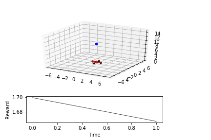

# Deep Reinforcement Learning Project

Deep Reinforcement Learning Project developed for Udacity's Deep Learning Nanodegree. The goal for this project was to use deep reinforcement learning to teach a quadcopter how to fly. The algorithm used for learning was Deep Deterministic Policy Gradients (DDPG) as described in the [Continuous control with deep reinforcement learning](https://arxiv.org/abs/1509.02971) paper.

%
movie.git

## Getting Started

Clone the repository:

``` batch
git clone https://github.com/Kazimbalti/Drone-Deep-Reinforcement-Learning-.git
cd quadcopter-project
```

Create a Conda GPU environment:

``` batch
conda create -n quadcopter python=3.6 matplotlib numpy pandas jupyter keras-gpu imageio
conda activate quadcopter
 ```

 or a Conda CPU environment:

 ``` batch
conda create -n quadcopter python=3.6 matplotlib numpy pandas jupyter keras imageio
conda activate quadcopter
 ```

Create an IPython kernel for the quadcopter environment:

``` batch
python -m ipykernel install --user --name quadcopter --display-name "quadcopter"
 ```

Open the Jupyter notebook for the project:

``` batch
 jupyter notebook Quadcopter_Project.ipynb
```

Before running code, change the kernel to match the quadcopter environment by using the drop-down menu (Kernel > Change kernel > quadcopter)

## Tools

Visualisation of agent learning can be done using visualise.py:

``` batch
python visualise.py --help
usage: visualise.py [-h] [--save] [num_episodes]

positional arguments:
  num_episodes  Number of episodes to render

optional arguments:
  -h, --help    show this help message and exit
  --save        Write animation to disk instead of displaying
```

For example the following will generate [movie.gif](movie.gif) containing the top five training episodes in the root of the repository:

``` batch
python visualise.py 5 --save
```

## References

The following resources were used in developing this project:

- [Continuous Control with Deep Reinforcement Learning](https://arxiv.org/abs/1509.02971)
- [Neural Network Weight Regularization](https://chrisalbon.com/deep_learning/keras/neural_network_weight_regularization/)
- Quadcopter 3d visualsation was based on code by Daniel Ingram (daniel-s-ingram) taken from [PythonRobotics](https://github.com/AtsushiSakai/PythonRobotics) repository
